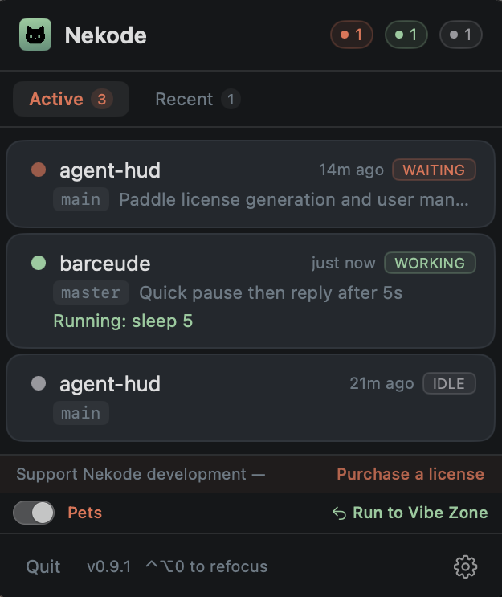

# Nekode

[](https://github.com/Jakob-98/nekode/releases/latest)
[](LICENSE)

**Desktop cats for keeping track of your agent coding sessions.**

Like Clippy, but useful! A macOS menubar monitor and pixel-art desktop cats for your [Claude Code](https://docs.anthropic.com/en/docs/claude-code), [opencode](https://opencode.ai), [VS Code Copilot](https://code.visualstudio.com/), and [GitHub Copilot CLI](https://docs.github.com/en/copilot/github-copilot-in-the-cli) sessions. Glance at your desktop to see which agents are working and which ones need you.

<p align="center">
  <a href="https://nekode.dev">nekode.dev</a>
</p>


<p align="center">
  
</p>

<table>
  <tr>
    <td align="center"><strong>4</strong><br>AI agents supported</td>
    <td align="center"><strong>0</strong><br>Network requests</td>
    <td align="center"><strong>100%</strong><br>Local & private</td>
    <td align="center"><strong>6</strong><br>Cat colors</td>
  </tr>
</table>

## Features

- **Menubar monitor** -- Every active AI session in one floating panel. Agent type, project directory, and color-coded state: working, waiting, needs permission, idle.
- **Desktop pets** -- Each session spawns a pixel-art cat. It sleeps when idle, walks when working, sits when waiting, and runs toward your cursor when it needs permission.
- **Jump to any session** -- Click a session card or double-click its cat to jump to the right window. Refocus mode: press a hotkey, numbered badges appear, press a number.
- **Pipe any command** -- Pipe any command into `nekode` to track it as a live session with its own cat. `cargo build | nekode`
- **Fully private** -- Zero network requests. No analytics or telemetry. All data stays in `~/.nekode/sessions/` as plain JSON files.
- **Lightweight** -- Native Swift. No Electron. No web views. Under 5 MB. No background services -- just local file watching.

<p align="center">
  
</p>

## Install

Requires **macOS 13 (Ventura)** or later.

**Homebrew:**

```bash
brew tap Jakob-98/nekode
brew install --cask nekode
```

**Or one-liner:**

```bash
curl -fsSL https://nekode.dev/install.sh | bash
```

**Or** [download the latest `.dmg` from GitHub Releases](https://github.com/Jakob-98/nekode/releases/latest).

## How it works

No servers. No accounts. Just local files.

1. **Install the hooks** -- Open Nekode settings and click "Install" next to your agent (Claude Code, opencode, Copilot, or Copilot CLI). For CLI commands, pipe into `nekode`.
2. **Hooks write JSON** -- Each integration writes session state updates to `~/.nekode/sessions/`. The menubar app watches that directory. That's the entire architecture.
3. **Cats appear** -- Each session spawns a cat. It mirrors the agent's state. Multiple cats gather in a vibe zone near the bottom of your screen. Double-click to jump to the session.

| Agent | Setup |
|-------|-------|
| **Claude Code** | Open Nekode settings, click "Install" next to Claude Code. Adds a hook to `~/.claude/hooks/`. |
| **opencode** | Open Nekode settings, click "Install" next to opencode. Adds the Nekode plugin to your opencode config. |
| **VS Code Copilot** | Open Nekode settings, click "Install" next to Copilot. Configures VS Code's `chat.agent.hooks` settings. |
| **GitHub Copilot CLI** | Open Nekode settings, click "Install" next to Copilot CLI. Hooks into GitHub Copilot in the terminal. |
| **CLI** | Pipe any command: `cargo build \| nekode` -- optionally use `--name` or `--project` flags. |

## Privacy

Zero network requests. No analytics. No telemetry. Session data stays on your machine as plain JSON files in `~/.nekode/sessions/`.

## Build from source

Requires Xcode 16+ and macOS 13+.

```bash
git clone https://github.com/Jakob-98/nekode.git
cd nekode
./scripts/bundle-macos.sh
cp -R dist/Nekode.app /Applications/
```

See [CONTRIBUTING.md](CONTRIBUTING.md) for development setup.

## License

MIT -- see [LICENSE](LICENSE) for full terms.

Originally built on [cctop](https://github.com/st0012/cctop) by [Stan Lo](https://github.com/st0012).
